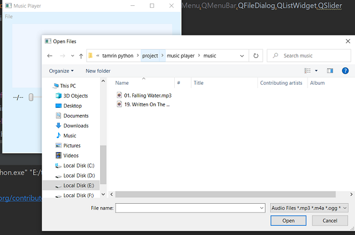
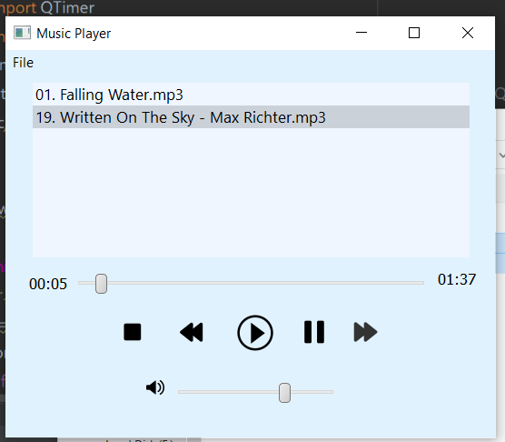

# Music-player
### Sceenshots
 1.first add songs to the playlist

   

 2.press play button to enjoy the song 

   

### Installation
1. Install requirements.txt
2. Run main.py

## Author
* **Afsaneh Shamsaddini**
